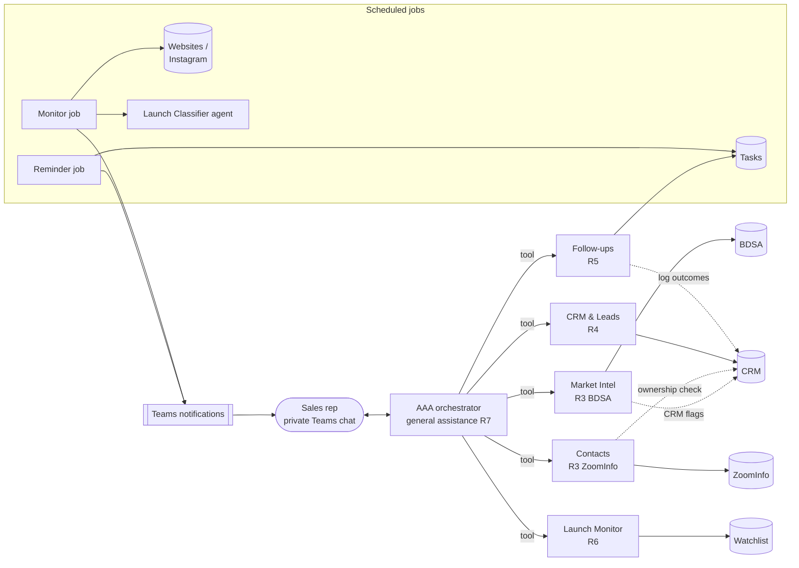

# AAA Agent Design

How the AAA sales assistant is split into agents, what each one does, and which rules
are enforced where. Requirements are in [business-requirements.md](business-requirements.md);
section numbers below (R1–R7) refer to that document.

## Architecture

**One orchestrator, specialists as tools.** Each rep talks to one agent, AAA. AAA calls
the specialists as tools rather than handing the conversation off to them, for three reasons:

- Real requests span several specialists. "Find me a good CA prospect and set up a follow-up"
  touches Market Intel, CRM, Contacts, and Follow-ups in sequence. With specialists as tools,
  AAA can chain them in one turn.
- The rep hears one consistent voice and AAA keeps the whole conversation, while each
  specialist has a small, focused prompt and toolset.
- General questions (R7) fall through to AAA itself without a separate agent.

Each specialist sees only the request AAA writes for it, not the chat history, so AAA's
instructions tell it to pass along every needed detail (names, states, IDs, dates).

## Agents

| Agent | Covers | Tools | Rules it follows |
|---|---|---|---|
| **AAA** (orchestrator) | R1, R7 | the five specialists | Check the CRM before suggesting outreach; never present a customer as a prospect; write only when asked; answer general questions directly |
| **Market Intel** | R3 BDSA | `top_brands` (10/20/30/50, month/quarter/year), `brand_detail`, `category_trends`, `top_products`, `list_states` | Every top-brands row carries its CRM status; existing customers and other reps' records are listed separately from prospects |
| **Contacts** | R3 ZoomInfo | `find_contacts` | Withholds contacts for companies another rep owns |
| **CRM & Leads** | R4 | `check_prospect`, `create_lead`, `get_record`, `my_pipeline`, `account_insights`, `log_activity` | Duplicate check before any lead; 4-step verdict flow; ownership by territory; insights include decline, lapsed categories, and whitespace |
| **Follow-ups** | R5 | `create_followup`, `list_followups`, `complete_followup`, `reschedule_followup` | Only on records you own; scheduling and completing both log to the CRM; knows today's date for "next Tuesday" |
| **Launch Monitor** | R6 | `watch_company`, `list_watches`, `recent_launch_alerts` | Only on records you own; alerts go to the record's current owner |
| **Launch Classifier** | R6 (background) | none; returns structured `LaunchAssessment` | Decides whether a post is really a launch and writes a one-line summary |

## Rules live in code, not prompts

Prompts guide the model; code enforces the rules. The model can't get around any of these
by phrasing a request differently:

| Rule | Where |
|---|---|
| The rep's identity comes from the signed-in user (run context), never from a tool argument. No tool accepts a rep ID. | `aaa/context.py`; checked by `tests/test_wiring.py` |
| `create_lead` re-runs the duplicate check itself and refuses on any match | `services/crm.py: create_lead` |
| Another rep's record shows only its status and owner, never contacts, notes, or history | `services/crm.py: _summary / _full` |
| Contacts are withheld for companies another rep owns | `specialists/contacts.py: lookup_contacts` |
| Order history and insights are visible only to the owner (and managers) | `services/crm.py: account_insights` |
| Follow-ups and watches only on records you own | `services/followups.py`, `services/monitor.py` |
| Reps see only their own tasks, notifications, and chat history | `services/followups.py`, `services/notify.py`, per-rep session DB in `__main__.py` |
| Company-name matching ignores Inc/LLC/Co but doesn't merge different companies ("North Fork Farms" vs "North Fork Provisions") | `services/crm.py: normalize, similarity`; website domain and contact email domain also match |

## Privacy (R2)

- **Conversations:** each rep has their own session store (`state/sessions/<rep>.db`). Nothing
  loads another rep's history. In Teams this maps to one 1:1 chat per user.
- **CRM data:** follows ownership. Everyone can see that a record exists, its status, and its
  owner (which R4.3 requires, to prevent duplicates). Details are owner- or manager-only.
- **Managers:** the `manager` role (Dana in the demo) sees all records. Confirm this matches
  the company's actual permission model.
- **Notifications:** go only to the rep they're addressed to.
- **Model provider:** conversations and tool results are sent to OpenAI to run the model, and the
  Agents SDK uploads traces to the OpenAI dashboard by default. For production, decide whether to
  disable tracing (`set_tracing_disabled(True)`) and what data retention terms are needed.

## Scheduled jobs

| Job | Command | Production schedule | Does |
|---|---|---|---|
| Reminders | `python -m aaa reminders` | Every weekday morning | One Teams message per rep listing follow-ups due today or overdue |
| Launch monitor | `python -m aaa monitor` | Every few hours | New posts from watched sites/Instagram → keyword pre-filter → Launch Classifier → one alert per company to the record owner, with summary and link |

The keyword pre-filter keeps model calls (and cost) down: hiring posts and event recaps never
reach the classifier. `--no-llm` skips the classifier entirely for demos without an API key.

## Mock data

`scripts/generate_mock_data.py` builds everything in `aaa/seed/` (fixed random seed, so it's
reproducible). All brands, people, emails, and phone numbers are fictional.

- **BDSA:** 6 states (CA, MI, IL, MA, CO, NV), 50 brands each, 12 months of product-level
  revenue (Oct 2025 to Sep 2026). Categories trend differently (Beverages up, Flower and Topicals
  down) so trend questions have real answers.
- **ZoomInfo:** 140 companies, 2–4 contacts each.
- **CRM:** 4 users (3 reps, 1 manager), 12 accounts, 4 leads, contacts, activities, 12 months of
  orders. Includes scenarios worth demoing:
  - CA's #1 brand (Sierra Pine Supply) is Alice's customer, so it's excluded from her prospect lists.
  - CA's #2 brand (Ember Labs) is Ben's lead, even though CA is Alice's territory. Alice is
    blocked from contacts and from creating a duplicate.
  - Copper Gardens (Alice) has declining orders, plus a whitespace gap: it sells edibles at retail
    but buys no edible packaging from us.
  - North Fork Provisions (Alice) stopped ordering one category three months ago.
- **Assumption:** our company sells packaging and supplies to cannabis brands, so each BDSA
  product category maps to a packaging line (`aaa/seed/catalog.json`). Change that mapping if
  the real product line differs.

## Requirement coverage

| Requirement | Status in prototype |
|---|---|
| R1 Teams integration | CLI stands in for the Teams 1:1 chat, and the outbox stands in for proactive messages. Not yet connected to Teams. |
| R2 Privacy and access | Built: per-rep sessions, ownership-based visibility, manager role |
| R3 BDSA research | Built on mock data: top 10/20/30/50, month/quarter/year revenue, products, categories, rankings, trends |
| R3 ZoomInfo contacts | Built on mock data |
| R4 CRM duplicate check and leads | Built: all four steps, territory ownership, activity logging |
| R4 Trends and opportunities | Built: per-customer category trends, lapsed categories, whitespace vs. BDSA |
| R5 Follow-ups | Built: create, list (overdue/upcoming), complete with CRM logging, reschedule, reminder job |
| R6 Launch monitoring | Built on a mock feed, with LLM classification and owner routing |
| R7 General assistance | Built: AAA answers directly under the same per-rep privacy |

## Path to production

1. **Teams:** host AAA as a Teams bot (Microsoft 365 Agents SDK or Bot Framework). Map each Teams
   user's Entra ID to a rep record to build `RepContext`. Key the session store by that ID.
   `notify.send()` becomes a proactive message to the rep's 1:1 conversation.
2. **CRM:** swap `services/crm.py` storage for the real CRM API (Salesforce, HubSpot, or Dynamics).
   Keep the rule functions. Prefer the CRM's own sharing rules for visibility, calling the API as
   the rep, rather than re-implementing them.
3. **BDSA / ZoomInfo:** replace `services/bdsa.py` and `services/zoominfo.py` internals with API
   calls. The tool signatures don't need to change.
4. **Calendar:** follow-ups could also create Outlook events through Microsoft Graph, if reps want them.
5. **Monitoring:** replace the feed with real collectors: site RSS, sitemap, or page diffs, and the
   Instagram Graph API or a social-listening vendor. Run both jobs on a scheduler.
6. **Storage:** move JSON state to a database.

## Open questions

These come from the "Implementation Details to Confirm" list, plus questions raised while building:

- Which CRM, and what are the real ownership and territory rules? The prototype assigns by state.
- Should another rep's record show its contacts to a teammate, or only status and owner as now?
- What can managers see? Should managers be able to reassign records through AAA?
- BDSA and ZoomInfo: API access, licensing, rate limits, which states and fields are covered.
- Reminder timing and channel preferences. Calendar events or Teams messages only?
- Monitoring: which accounts, how often, and is Instagram API access available?
- Data retention for conversations and traces. Who has admin access?
